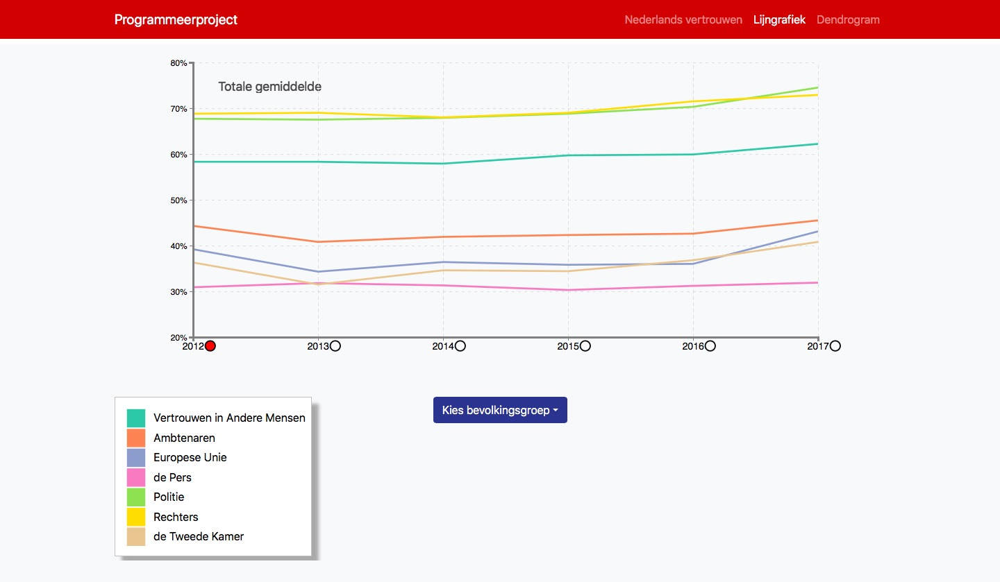
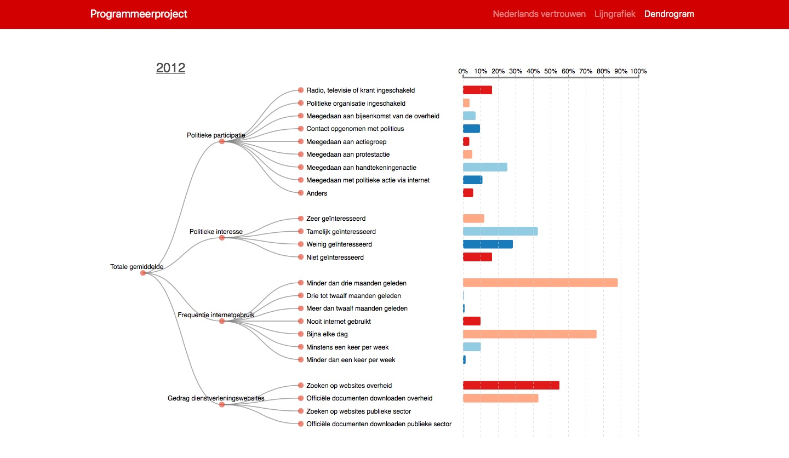

# Project
[My site!](https://michaelzon.github.io/vertrouwen_in_nederland/)

## Titel van applicatie:

Exploratie van verschillen onder Nederlandse bevolkingsgroepen in participatie, interesse en vertrouwen in de politiek tussen 2012 en 2017.

## Screenshots:

## Doel van applicatie:

Het doel is om de gebruiker te laten ontdekken waar de verschillen liggen tussen nederlanders met verschillende migratie-achtergronden jegens vertrouwen in overheid, publieke organisaties, elkaar en met een beter overkoepelende term: de politiek. Verder kan worden geëxploreerd welke variabelen hier mogelijk een effect op hebben. De eerste visualisatie is een multi-lijngrafiek waar de gebruiker kan aflezen hoeveel vertrouwen men heeft in de bijbehorende variabelen. Deze variabelen zijn door de auteur gekozen die volgens hem relevant zijn met betrekking tot de overheid en politiek. De pers is toegevoegd omdat dit een orgaan is van het politieke landschap. De variabele ‘vertrouwen in andere mensen’ is toegevoegd om contrast tussen andere variabelen te scheppen. Zo kan door de gebruiker worden afgelezen of een bevolkingsgroep meer vertrouwen heeft in een ander of bijvoorbeeld de politie, of rechters etc. De tweede en derde visualisatie is respectievelijk een dendrogram met een horizontale staafdiagram. Hier worden onderwerpen belicht die mogelijk een invloed kunnen zijn op het vertrouwen van de Nederlanderse bevolkingsgroepen op de politiek: politieke participatie, politieke interesse, internetgebruik en gedrag op overheids- en publiekesector-websites. Als de gebruiker een jaar aanklikt in de lijngrafiek dan krijgt de gebruiker de gegevens te zien van dat jaar. Via het dropdown menu kan de gebruiker een bevolkingsgroep selecteren.

# Naam en auteursrechten:

Copyright (c) 2018 Michael Franklin Zonneveld

# Bronnen:

https://opendata.cbs.nl/statline/#/CBS/nl/

https://bl.ocks.org/mbostock/4339083

https://bl.ocks.org/dahis39/f28369f0b17b456ac2f1fa9b937c5002

https://bl.ocks.org/basilesimon/29efb0e0a43dde81985c20d9a862e34e

http://www.d3noob.org/2014/01/tree-diagrams-in-d3js_11.html

https://bl.ocks.org/mbostock/3884955
